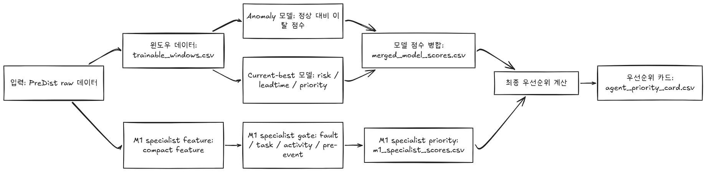
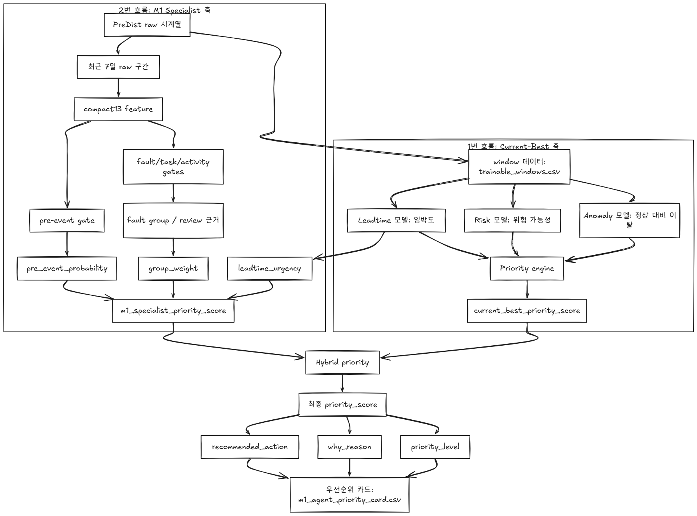

# heat_grid_agent_auto

## 요약
- 자동감지 에이전트의 입력-모델-출력 구조를 요약한 개요 문서입니다.
- 1번~4번 흐름과 보충 설명 문서를 따라 우선순위 산정 로직을 읽을 수 있습니다.

## 원문

# 0. 입력-모델-출력 구조

---

# 1. [1번 흐름](흐름/1번 흐름.md): 입력-Anomaly/best-우선순위

---
# 2. [2번 흐름](흐름/2번 흐름.md): 입력-M1 Specialist-우선순위

---
# 3. [3번 흐름](흐름/3번 흐름.md): Hybrid priority

---
# 4. [4번 흐름](흐름/4번 흐름.md): 우선순위 카드

---
# 5. [부족](부족.md)
