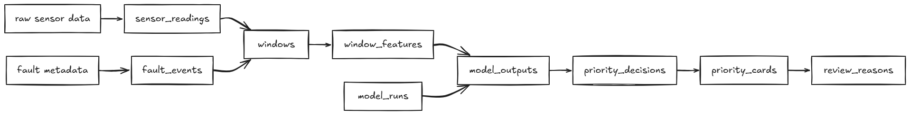
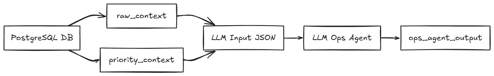

# heat_grid_agent_ops

## 요약
- 운영보조 에이전트가 참조하는 DB 구조와 JSON 설계를 정리한 개요 문서입니다.
- Raw, model, Priority, OPS 데이터가 어떤 순서로 연결되는지 보여줍니다.

## 원문

# 1. DB 구조




```
SENSOR_READINGS
= raw 센서값

WINDOWS
= 분석 단위

WINDOW_FEATURES
= 모델에 들어간 feature들
  compact13도 여기에 저장

MODEL_OUTPUTS
= anomaly, risk, leadtime, M1 gate 같은 모델 결과

PRIORITY_DECISIONS
= Current-Best + M1 + hybrid priority 점수 계산 결과

PRIORITY_CARDS
= 운영자가 볼 카드

SENSOR_SUMMARIES
= 카드에 보여줄 Top 3 센서 요약

LLM_OPS_NOTES
= LLM이 만든 운영 요약/액션/주의사항
```

## 1. [Raw Data](순서/Raw Data.md) 구조
## 2. [model Data](순서/model Data.md)  구조
## 3. [Priority Data](순서/Priority Data.md) 구조
## 4. [OPS Data](순서/OPS Data.md) 구조

---

# 2. JSON 설계




## 1. [ops_agent_input.schema.json](순서/ops_agent_input.schema.json.md)
## 2. [ops_agent_output.schema.json](순서/ops_agent_output.schema.json.md)
