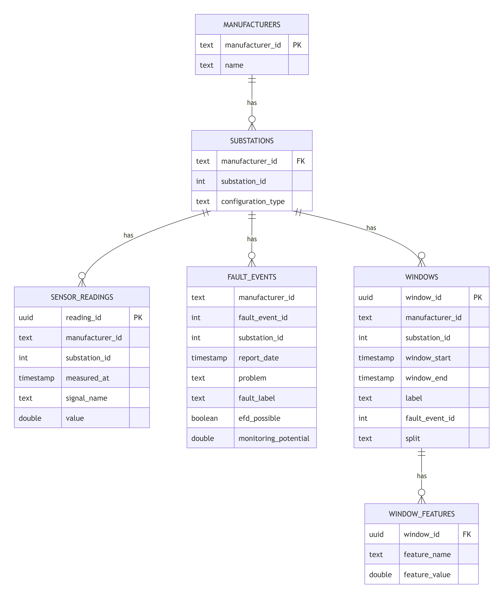

# Raw Data

## 요약
- 이 문서는 `0. 구조도`를 중심으로 정리된 세부 설명입니다.
- 관련 문서: `Pasted image 20260706200426.png`

## 원문

# 0. 구조도

# 1. 나누는 방법

## 1. 데이터의 종류별로
| 종류       | 예시                                                  | 역할                  |
| -------- | --------------------------------------------------- | ------------------- |
| 센서 시계열   | 온도, 유량, valve position, pump status                 | 모델 입력의 원재료          |
| 고장 메타데이터 | fault event, report date, fault label, efd_possible | window label과 검증 기준 |

그래서 DB도 sensor_readings과 fault_events로 나눠야 한다.

## 2. 모델 입력 단위 window

windows, window_features로 설계한다.

window_features는 센서 원본을 모델 입력용 숫자로 요약한 값이다.

#### window_features 예시

|window_id|feature_name|feature_value|
|---|---|---|
|win_001|p_hc1_return_temperature__last_1d_mean_minus_prev_6d_mean|-0.42|
|win_001|outdoor_temperature__last_minus_first|3.10|
|win_001|p_net_meter_flow__last_1d_std_minus_prev_6d_std|0.87|
