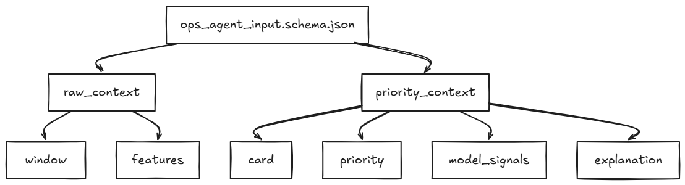
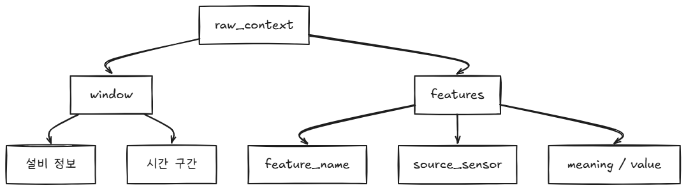

# ops_agent_input.schema.json

## 요약
- 이 문서는 `![[Pasted image 20260706215700.png]]`를 중심으로 정리된 세부 설명입니다.
- 관련 문서: `Pasted image 20260706215700.png`, `Pasted image 20260706215725.png`, `raw_context.json`, `feature_meta_map`

## 원문




# 1. raw_context




### 예시 json: [raw_context.json](예시/raw_context.json.md)

- 매핑표는 만들어줘야 한다: [feature_meta_map](보충 설명/feature_meta_map.md)

---

## 2. priority_context


### 예시 json: [priority_context.json](예시/priority_context.json.md)

---

## 3. 최종 예시 json: [ops_agent_input.json](예시/ops_agent_input.json.md)

#### 호출 단위: 

```
card_id 1개 = ops_agent_input.json 1개 = LLM 호출 1번
```

#### 흐름:

```
card_id 선택
→ DB에서 raw_context 조립
→ DB에서 priority_context 조립
→ 둘을 합쳐 ops_agent_input.json 생성
→ LLM 호출
→ 결과를 LLM_OPS_NOTES에 저장
```
