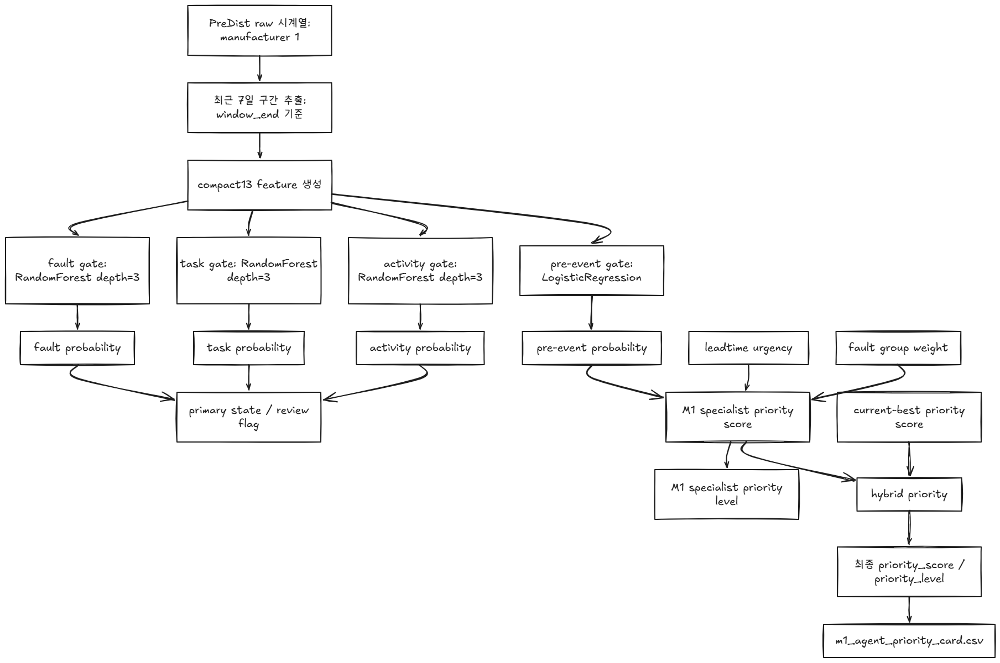
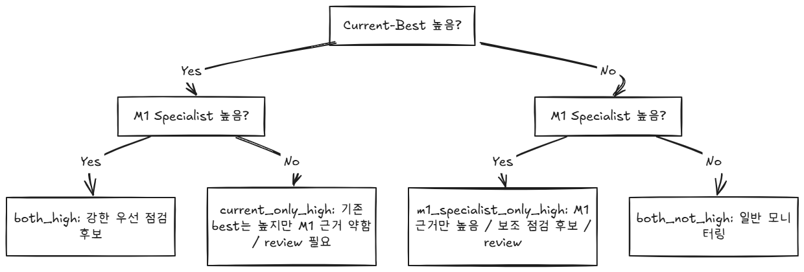
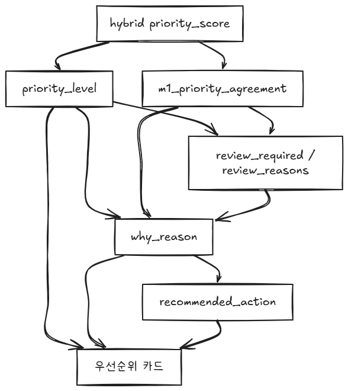

# 03_자동감지_흐름

## 요약
- 자동감지 에이전트의 1번~4번 흐름을 한 문서에 모았습니다.
- 우선순위 산정 로직을 순서대로 검토할 때 사용하는 묶음입니다.

---

## 1번 흐름

: 입력-Anomaly/best-우선순위
# 1. window 데이터
.png)

- 6시간 윈도우는 raw 시계열을 6시간짜리 묶음으로 자르고, 그 묶음을 하나의 표의 한 행으로 요약
- 이때 통계는 first/last/mean/min/max/std/delta/missing_count/missing_rate
- 실제 사용 센서 14개 / 파생 센서 3개 → 17개를 6시간 통계 → 145개 feature

---

# 2. Anomaly 모델

> **정상 운전 패턴에서 벗어난 정도를 잡는 이상탐지 모델**
> 
> 평소 정상 기계실 데이터들을 보고 "이 정도가 정상 범위구나"를 학습한 뒤,  
> 새로운 시간 구간이 그 정상 범위에서 얼마나 벗어났는지 점수화하는 모델

.png)
## 1. IsolationForest

- 정상 데이터를 사이에서 혼자 동떨어져 보이는window를 찾음
- 정상 window는 온도, 유량, 열량 변화가 비슷한데 어떤 window만 패턴이 튀면 이상하다고 봄

## 2. Mahalanobis distance

- 정상 데이터 분포의 중심에서 얼마나 멀리 떨어졌는지 봄
- 그냥 값 하나가 큰지만 보는게 아니라 feature들 사이의 관계까지 고려함
- 공급온도, 환수온도, 유량 조합이 정상적인 조합인지 본다.

## 3. 왜 두 개를 같이 쓰는가?

- 한 모델만 보면 오탐이 생길 수 있기 때문이다. 둘 다 이상하다고 봐야 anomaly 신호로 인정한다.
- 한 번 튄다고 바로 알람으로 잡지 않고, 이상 신호가 누적되어야 이벤트가 된다.
- 그래서 여기서 anomaly 모델의 역할: 이 기계실의 이 시간 구간이 정상 운전 패턴에서 벗어났는가?
---

# 3. Current-Best 모델

> **risk + leadtime + priority engine 결과를 담은 기존 모델**

.png)

|구성|질문|주요 출력|
|---|---|---|
|`risk`|이 window가 고장/정비 전 위험 구간일 가능성이 높은가?|`risk_probability`, `risk_score`, `risk_level_calibrated`|
|`leadtime`|위험하다면 얼마나 임박한 쪽인가?|`predicted_lead_time_bucket`, `leadtime_urgency_score`|
|`priority`|여러 기계실 중 어디를 먼저 봐야 하나?|`priority_score`, `priority_level`, `priority_reason`|

## 1. Risk 모델

- 질문:

```jsx
이 window가 신고/정비 전 위험 구간일 가능성이 높은가?
```

- 주요 입력:

```jsx
anomaly_score
iforest_score_ratio
mahalanobis_score_ratio
mw_anomaly_1h_score
mw_anomaly_3h_score
risk_probability_roll4_max
risk_probability_roll8_mean
risk_recent_high_count_48h
risk_repeated_high_48h
risk_score_24h_max
risk_score_3d_mean
risk_score_7d_slope
```

단일 시점만 보는 것이 아니라 24h/3d/7d 흐름도 본다.

- 주요 출력:

```jsx
risk_probability
risk_score
risk_level_calibrated
risk_high_or_critical
```

## 2. Leadtime 모델

- 질문:

```jsx
위험하다면 얼마나 임박했는가?
```

- 주요 출력:

```jsx
predicted_lead_time_bucket
predicted_lead_time_confidence
leadtime_prob_0-24h
leadtime_prob_1-3d
leadtime_prob_3-7d
expected_lead_time_hours
leadtime_urgency_score
```

- 분류 버킷:

```jsx
0-24h
1-3d
3-7d
```

정확한 고장 시각 예측은 아니지만, 우선순위 계산에 들어가는 임박도 참고 신호이다.

---

## 3.`Priority Engine`


- 질문:

```jsx
여러 기게실 중 어디를 먼저 봐야 하는가?
```

- 주요 출력:

```jsx
priority_score
priority_level
priority_reason
engine_version
```

---

## 2번 흐름

: 입력-M1 Specialist-우선순위



# 1. 입력


## 1. 최근 7일 구간 흐름: 7일 window

- 앞단에서 `6시간 윈도우`에 맞는 window_end로부터 계산
- 6시간 판단 시점마다 과거 7일을 참고해서 M1 feature를 만든다.
  
```
window_end - 7일 ~ window_end
```

## 2. M1 specialist compact13 feature

```
outdoor_temperature__last_12h_mean_minus_prev_12h_mean
p_hc1_return_temperature__last_1d_mean_minus_prev_6d_mean
p_net_meter_flow__last_1d_std_minus_prev_6d_std
p_return_gap__last_minus_first
s_hc1_supply_temperature_error__last_minus_first
```

7일 윈도우 안에서 최근 6시간/12시간/1일 변화가 이전 기간과 얼마나 달라졌나? 를 본다.

---
# 2. 모델

`M1 Specialist의 모델`은 4개이다.

|모델|타입|질문|
|---|---|---|
|`fault_gate`|RandomForest depth=3|fault 상태처럼 보이나?|
|`task_gate`|RandomForest depth=3|정비 task 맥락처럼 보이나?|
|`activity_gate`|RandomForest depth=3|운영 activity 맥락처럼 보이나?|
|`fault_pre_event_gate`|LogisticRegression|fault 전조 구간처럼 보이나?|

이 모델들이 risk/leadtime 을 대체하지 않는다. 보조 근거를 만드는 친구들이다.

---
# 3. `M1 Specialist Priority 점수`

```
m1_specialist_priority_score
= 100 * (
    0.55 * m1_specialist_pre_event_probability
  + 0.30 * m1_specialist_leadtime_urgency
  + 0.15 * m1_specialist_group_weight
)
```

| 항목                      | 가중치  | 이유                      |
| ----------------------- | ---- | ----------------------- |
| `pre_event_probability` | 0.55 | fault 전조 가능성을 제일 중요하게 봄 |
| `leadtime_urgency`      | 0.30 | 임박할수록 우선순위 상승           |
| `fault_group_weight`  | 0.15 | 고장군별 운영 중요도 보정          |
```
fault/task/activity gate = 맥락 구분용
pre_event gate = 고장 전조 판단용
priority score = pre_event를 중심으로 leadtime과 고장군 가중치 결합
```

---

## 3번 흐름

: Hybrid Priority


```
1번 흐름: window -> anomaly/current-best -> current_best_priority
2번 흐름: raw 최근 7일 -> M1 specialist -> m1_specialist_priority
최종: 둘을 0.65 / 0.35로 결합
```

# 1. 1번 흐름의 결과

> 기존 best 판단

```
anomaly
+ risk
+ leadtime
+ 반복/지속 신호
+ 운영 context
-> priority engine
-> current_best_priority_score
```

산출물:
```
current_best_priority_score
current_best_priority_level
```

# 2. 2번 흐름의 결과

> M1 전용 보조 판단

```
최근 7일 raw 변화
-> compact13
-> fault/task/activity/pre-event gates
-> m1_specialist_priority_score
```

```
m1_specialist_priority_score
= 100 * (
    0.55 * m1_specialist_pre_event_probability
  + 0.30 * m1_specialist_leadtime_urgency
  + 0.15 * m1_specialist_group_weight
)
```

산출물:
```
m1_specialist_priority_score
m1_specialist_priority_level
```

# 3. 최종 결합: `0.65와 0.35`


```
m1_hybrid_priority_score
= 0.65 * current_best_priority_score
+ 0.35 * m1_specialist_priority_score
```



---

## 4번 흐름

: level, reason, action




# 1. `level`: 점수를 운영 등급으로 바꾼 값

```
priority_score = 숫자
priority_level = urgent / high / medium / low
```

- 역할: 운영자가 얼마나 먼저 봐야 하는지 빠르게 판단하게 함

# 2. reason: 왜 그 등급이 나왔는지 설명하는 근거

```
current_best_priority=urgent
m1_specialist_priority=medium
m1_hybrid_priority=urgent
agreement=current_only_high
fault_gate=0.723
pre_event=0.800
fault_group=leakage_water_loss

=
기존 모델은 긴급으로 판단했고, M1 specialist는 중간 수준의 전조 신호를 보였습니다.
fault gate와 pre-event 확률이 높으며, 누수/수손실 계열 고장군 가능성이 있습니다.
```

- 역할: 모델이 왜 이 설비를 높게 봤는지 설명

# 3. action: 그 판단을 보고 운영자가 뭘 해야 하는지 행동

```
urgent review:
current best and M1 specialist both support high priority.

우선 검토: 
위험도가 높고 전조 신호가 있으므로 최근 작업 이력과 센서 결측을 확인한 뒤 현장 점검 후보로 올리세요.
```

- 역할: 점수와 설명을 실제 운영 행동으로 연결 = 권장 조치
