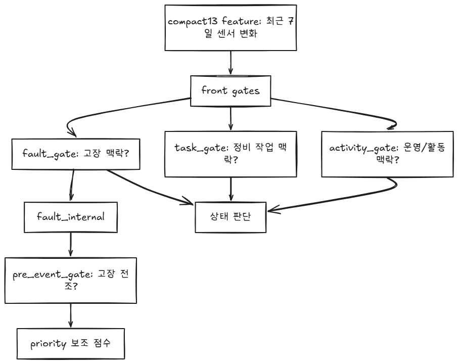

# 04_자동감지_보충설명

## 요약
- 자동감지 흐름에서 참조하는 세부 개념 문서를 모았습니다.
- 가중치, 게이트, 윈도우, 레벨 기준 같은 설명을 보존합니다.

---

## 0.65와 0.35

# 1. 현재 논리

current-best를 주 판단으로 유지한다. M1 specialist는 보조 검증기로 쓴다.
오탐을 줄이는 쪽이 운영상 더 낫다.

그래서 current-best 65%, M1 35%

```
holdout 기준

current_best:
precision 0.725
recall    0.753
FPR       0.208

m1_specialist:
precision 0.640
recall    0.416
FPR       0.170

0.65/0.35 hybrid:
precision 0.897
recall    0.675
FPR       0.057
```

# 2. 추가 실험

```
1.00 / 0.00  = current-best만 사용
0.90 / 0.10
0.80 / 0.20
0.70 / 0.30
0.65 / 0.35  = 현재 공식
0.60 / 0.40
0.50 / 0.50
0.40 / 0.60
0.00 / 1.00  = M1 specialist만 사용
```

### 실험 설계

current-best는 잘 잡지만 너무 많이 울리고, M1 specialist는 보수적이지만 단독으로는 약해서,
둘을 섞어 오탐을 줄이려는 가중치 선택을 하려고 진행한다.

정확히 왜 0.65/0.35가 최적인가에 대한 근거는 부족하다.
M1 specialist를 어느 정도 섞으면 오탐이 줄어드는 효과가 있다.
하지만 그 유일한 최적값이 0.65/0.35인지는 추가 검증이 필요하다.

따라서 가중치 세트를 비교해서 
precision, recall, FPR, fault_event_recall, top-K precision을 같이 봐야 한다.

### 실험 방식

각 가중치마다 validation에서 high threshold를 다시 고르고, holdout에서 평가했다.

```
score = w_current * current_best_priority_score
      + w_m1 * m1_specialist_priority_score
```

### 실험 결과

|current|M1|threshold|precision|recall|FPR|TP|FP|FN|fault event recall|top10 pre_fault|
|---|---|---|---|---|---|---|---|---|---|---|
|1.00|0.00|67.5|0.897|0.675|0.057|52|6|25|0.875|10|
|0.90|0.10|70.0|0.912|0.675|0.047|52|5|25|0.875|10|
|0.80|0.20|67.5|0.897|0.675|0.057|52|6|25|0.875|10|
|0.70|0.30|67.5|0.897|0.675|0.057|52|6|25|0.875|10|
|0.65|0.35|67.5|0.897|0.675|0.057|52|6|25|0.875|10|
|0.60|0.40|67.5|0.895|0.662|0.057|51|6|26|0.875|10|
|0.50|0.50|65.0|0.812|0.675|0.113|52|12|25|1.000|10|
|0.40|0.60|62.5|0.714|0.714|0.208|55|22|22|1.000|10|
|0.30|0.70|65.0|0.690|0.636|0.208|49|22|28|0.875|10|
|0.20|0.80|72.5|0.729|0.455|0.123|35|13|42|0.875|10|
|0.10|0.90|77.5|0.738|0.403|0.104|31|11|46|0.875|10|
|0.00|1.00|77.5|0.640|0.416|0.170|32|18|45|0.875|10|

0.90 current-best / 0.10 M1 specialist 가 holdout 기준으로 제일 좋아 보인다.

```
0.9/0.1 일 때:
precision 0.912
recall    0.675
FPR       0.047
FP        5
```

현재 공식인 0.65 / 0.35 는
```
precision 0.897
recall    0.675
FPR       0.057
FP        6
```

따라서 0.8/0.2, 0.7/0.3, 0.65/0.35 가 거의 같은 성능 대에 묶인다. 
0.35가 특별히 튀어나온 최적값이 아니다.

M1 specialist를 조금 섞는 건 괜찮으나, 비중을 0.5 이상으로 키우면 FP/FPR이 늘어난다.
0.65/0.35는 방어 가능한 값이지만, 실험 상 최적이라고 주장하긴 어렵다.

따라서 0.9/0.1 또는 0.8/0.2가 더 낮거나 유사한 FPR을 보여 더 적합한 가중치라고 볼 수 있다.

---

## 6시간 윈도우

# 1. trainable_windows

```
window_start = 2019-12-01 00:00
window_end   = 2019-12-01 06:00
```

1번 흐름의 입력은 6시간 윈도우라서, 일단 제일 먼저 생기는 윈도우가 6시간 판단 단위로 생김

# 2. M1 specialist의 평가

이 6시간 윈도우를 그대로 보지 않고, window_end를 기준으로 과거 7일 raw 데이터를 다시 본다.

```
M1 specialist compact window:
window_end - 7일 ~ window_end
```

example:
```
판단 대상 window:
2019-12-01 00:00 ~ 2019-12-01 06:00

M1 specialist가 feature 계산에 쓰는 과거 구간:
2019-11-24 06:00 ~ 2019-12-01 06:00
```

# 3. 구조


### why?

- M1 specialist feature:
```
last_12h_mean_minus_prev_12h_mean
last_1d_mean_minus_prev_6d_mean
last_6h_mean_minus_prev_6h_mean
last_minus_first
```

이런 피쳐들은 6시간 하나만 보면 계산이 안된다.

그래서 판단은 6시간 단위로 하지만, feature는 과거 7일 맥락을 써서 계산한다.

---

## fault_group_weight

## 1. fault_group_weight의 의미?

고장군별로 얼마나 자주 나오고, 얼마나 모니터링 가능한 고장인가를 반영한 보정값이다.
고장군별 이벤트 수와 고장군별 고장일 가능성이 얼마나 큰지를 조합한 가중치이다.

|fault_group|rows|mean_monitoring_potential|frequency_norm|monitoring_norm|group_weight|
|---|---|---|---|---|---|
|control_controller|12|3.9167|1.0000|1.0000|1.0000|
|pump_failure|5|3.7800|0.4167|0.9651|0.6360|
|valve_actuator|5|3.2400|0.4167|0.8272|0.5809|
|pressure_regulator|4|3.1500|0.3333|0.8043|0.5217|
|leakage_water_loss|5|1.9000|0.4167|0.4851|0.4440|
|unknown_review|2|없음|0.1667|0.0000|0.1000|
- monitoring_potential: 그 고장이 센서 데이터로 관측/탐지될 가능성이 얼마나 큰지?

---

## 2. 실제 가중치

|fault_group|group_weight 근거|
|---|---|
|control_controller|1.000000|
|pump_failure|0.636043|
|valve_actuator|0.580894|
|pressure_regulator|0.521702|
|leakage_water_loss|0.444043|
|unknown_review|0.100000|
control_controller가 1.0인 이유는 M1 데이터에서 제일 자주 나오고, monitoring potential도 제일 높았기 떄문이다.

반면, leakeage_water_loss는 event 수는 5개로 pump/value와 비슷하ㅣ만, monitoring potential 평균이 1.9로 낮아서 weight가 낮아졌다.

unknown_review는 학습/자동 우선순위 판단 대상으로 보기 어렵기 때문에 0.1로 낮게 뒀다.

## 3. 결론

주 판단 신호가 아니고 0.15의 영항이다.

그러나 event수가 작기 때문에 절대적인 고장 심각도표가 아니다. 데이터가 늘어나거나 운영 기준이 생기면 다시 조정해야 한다.

---

## Gate

# 1. Front Gate Threshold: 0.5

| 모델              | 타입                   | 질문                  |
| --------------- | -------------------- | ------------------- |
| `fault_gate`    | RandomForest depth=3 | 이 패턴이 fault 쪽인가?    |
| `task_gate`     | RandomForest depth=3 | 정비 task 쪽인가?        |
| `activity_gate` | RandomForest depth=3 | 일반 운영 activity 쪽인가? |
RF gate 출력은 해당 class일 확률처럼 쓰인다.
그래서 0.5는 그 class일 가능성이 아닐 가능성보다 크면 통과라는 기준이다.

fault_probability >= 0.5 → fault일 가능성이 normal보다 크다고 판단

**왜 0.5를 썼냐?** fault/task/activity gate는 먼저 상태를 나누는 front gate라서이다.

너무 보수적으로 잡으면 초기에 세 라벨 후보를 놓칠 수 있고,
너무 낮게 잡으면 normal이 너무 많이 들어와서 첫 runtime에는 분류기의 기본 기준으로 검증

|gate|threshold 0.5 결과|
|---|---|
|fault_gate|balanced accuracy 0.8455, recall 0.8909, normal FPR 0.2000|
|task_gate|balanced accuracy 1.0000, normal FPR 0.0000|
|activity_gate|balanced accuracy 1.0000, normal FPR 0.0000|

특히 fault gate는 0.45, 0.5, 0.55, 0.6 중에서 비교됐고, 0.5가 balanced accuracy 기준으로 가장 좋았다.

(balanced accuray = (normal을 맞춘 비율 + fault를 맞춘 비율) / 2, 고장도 잘 잡고 정상도 잘 거르는지”를 반반으로 보는 점수)

|fault_gate threshold|balanced accuracy|
|---|---|
|0.45|0.8351|
|0.50|0.8455|
|0.55|0.7909|
|0.60|0.7649|

---

# 2. Pre-event Gate Threshold: 0.6

> 일반 fault gate보다 더 보수적인 기준을 적용
> 이미 fault gate 안에서 이게 진짜 고자 전조 위험인가?를 다시 보는 단계라서 오탐을 줄이는 쪽으로 목표를 세움

|기준|값|
|---|---|
|평가 row|49개|
|normal|35개|
|positive|14개|
|threshold|0.6|
|balanced accuracy|0.8500|
|recall|0.7857|
|normal FPR|0.0857|
|FP / FN|3 / 3|
0.6 기준에서 고장 전조 14개 중 11개 탐지, 정상 35개 중 3개만 오탐이라는 결과다.

**0.5랑 비교하면 왜 0.6이냐?**

|threshold|balanced accuracy|recall|FP|
|---|---|---|---|
|0.4|0.6000|0.5714|13|
|0.5|0.6286|0.5714|11|
|0.6|0.6500|0.5000|7|
|0.7|0.6286|0.4286|6|

0.6 은 0.5보다 recall은 조금 낮지만, FP가 11에서 7로 줄고, BA가 가장 높다.
0.7 로 올리면 FP는 조금 더 줄지만 recall이 더 떨어진다.

따라서 0.6은 오탐을 줄이면서 전조 탐지 성능을 유지하는 기준이다.

**한계** : 현장 출동 비용까지 반영한 최종 운영 최적값은 아니다. 운영 비용/SLA가 생기면 다시 조정.

---

## level

# 레벨의 기준?

>**validation 데이터에서 오탐을 제한하면서 recall을 최대화하도록 고른 threshold**

검증 데이터 기반 threshold calibration 
= 오탐을 20% 이하로 제한하면서 실제 위험 후보를 최대한 잡는 등급 기준이다.

# 1.로직

```
1. validation split만 본다.
2. threshold 후보를 20 ~ 95 사이에서 훑는다.
3. 각 threshold에서 high/urgent 판정을 만든다.
4. false positive rate <= 0.20 조건을 만족하는 후보 중
5. recall이 가장 높은 threshold를 고른다.
6. recall이 같으면 precision이 높은 쪽을 고른다.
```

- 기준 철학: 정상 설비를 너무 많이 high/urgent로 올리지 않으면서, 진짜 pre_fault는 최대한 많이 잡자.

#### 1. high threshold

```
if FPR <= 0.20:
    candidate = (recall, precision, threshold)
    가장 좋은 candidate 선택
```

high threshold = 67.5 는 validation split에서 이 조건을 만족하는 threshold 중 선택된 값

#### 2. urgent threshold

```
urgent_threshold
= max(high_threshold + 15, validation score의 90% 분위값)
단, 최대 95
```

urgent는 high 기준보다 충분히 더 높거나, validation 상위 10% 에 해당하는 점수

#### 3. medium threshold

```
medium_threshold = max(20, high_threshold * 0.60)
```

medium threshold는 운영용 보조 등급이다.

---

# 2. level threshold의 한계

왜 FPR 허용치를 0.20으로 잡았는지 근거가 없다.

0.20은 모델이 정한 값이 아니라 사람이 정한 허용 오탐률이다.
근데 왜 그 허용치가 맞는지 운영/실험 근거가 부족하다.

#### 1. 해결 방안
FPR cap = 0.05 / 0.10 / 0.15 / 0.20 각각에서 high threshold를 다시 잡고 holdout precision, recall, FPR, top-K를 비교

#### 2. 결정 이유
우리는 넓게 잡는 데모 목적이니까 0.20, 운영 신뢰도를 우선하니까 0.10, 아주 보수적으로 가니까 0.05

---

## LogisticRegression_balanced

# 1. LogisticRegression

입력 13개를 보고 이 window가 fault pre-event일 확률 = 0.72 라는 결과를 낸다.

즉, 결과가 바로 고장/정상이 아니라 확률로 준다.

# 2. balanced

고장 전조 데이터는 보통 정상 데이터보다 훨씬 적다. 
그냥 학습하면 모델이 거의 다 정상이라고 해도 맞는 것처럼 보인다.

balanced는 적은 클래스, 즉 fault/pre-event 쪽을 학습할 때 더 중요하게 보라는 뜻이다.

정확히는 클래스 비율에 따라 가중치를 줘서, 소수 클래스가 묻히지 않는 방식이다.

# 3. threshold = 0.6

모델이 확률을 냈을 때, 

```
0.59 -> pre-event 아님
0.60 -> pre-event 맞음
0.85 -> pre-event 맞음
```

으로 판단한다는 뜻이다.

좀 더 보수적으로 잡아서, 애매해도 전조라고 판단하는 것, 즉 오탐을 줄이겠다는 목적이다.

---

## M1 Specialist Priority 점수

| 항목                      | 가중치  | 이유                      |
| ----------------------- | ---- | ----------------------- |
| `pre_event_probability` | 0.55 | fault 전조 가능성을 제일 중요하게 봄 |
| `leadtime_urgency`      | 0.30 | 임박할수록 우선순위 상승           |
| `fault_group_weight`  | 0.15 | 고장군별 운영 중요도 보정          |

#### 왜 risk가 제일 큰가?
priority의 핵심은 결국 이 건이 실제 고장 전조인가이다.

leadtime은 언제 대응할까를 보조하고, 
group_weght는 어떤 고장군이면 조금 더/덜 중요하게 볼까를 보정하는 정도이다.

#### 비교
| scenario        | risk | leadtime | group | top10 overlap | rank change | 판단    |
| --------------- | ---- | -------- | ----- | ------------- | ----------- | ----- |
| baseline_28     | 0.55 | 0.30     | 0.15  | 1.0           | 0.0         | 기준안   |
| risk_heavy      | 0.70 | 0.20     | 0.10  | 0.7           | 2.24        | 탈락/검토 |
| leadtime_heavy  | 0.45 | 0.40     | 0.15  | 1.0           | 0.67        | 후보    |
| group_heavy     | 0.45 | 0.25     | 0.30  | 0.7           | 2.18        | 후보    |
| balanced_policy | 0.50 | 0.30     | 0.20  | 1.0           | 1.03        | 후보    |
첫 기준은 역할 우선순위를 고려해서 임의로 가중치를 잡고,
기준을 중심으로 각 가중치를 비율별로 조절하였을 때 기준안이 가장 안정적으로 top10을 유지

---

## M1 Specialist의 모델



# 1. 모델이 4개인 이유?

하나의 고장이다/아니다 모델로 끝내기에는 운영 상태 라벨들이 섞여 있기 떄문이다.
고장 전조를 보면서도, 그 신호가 실제 fault인지, task인지, 일반 activity 인지 구분하려 한다.

```
1. 고장/정비/운영활동을 먼저 분리하고
2. 고장 쪽에서는 다시 pre-event 전조 가능성을 따로 본다
```

왜 이렇게 복잡한 구성이냐?
```
이게 진짜 점검 우선순위를 올릴 만한 고장 전조인가?
아니면 정비/운영활동 때문에 생긴 변화인가?
```
를 단계별로 확인하고 싶었기 때문이다.

# 2. Front `Gate` 3개

| 모델              | 타입                   | 질문                  |
| --------------- | -------------------- | ------------------- |
| `fault_gate`    | RandomForest depth=3 | 이 패턴이 fault 쪽인가?    |
| `task_gate`     | RandomForest depth=3 | 정비 task 쪽인가?        |
| `activity_gate` | RandomForest depth=3 | 일반 운영 activity 쪽인가? |

왜 나누냐? 센서 패턴이 튀는 이유가 꼭 고장만은 아니기 때문이다.

온도/유량 패턴 변화가 있어도 원인은 여러 가지일 수 있다.
진짜 고장 전조 / 정비 작업 이후 변화 / 운영 모드 변경 / 일반 활동/제어 변화 등의 원인이 존재하고, 이를 하나의 모델로 이상=고장 이라고 하면 오탐이 많아진다.

그래서 먼저 fault/task/activity 세 gate로 맥락을 분리한다.

# 3. Fault 내부 pre-event gate 1개

fault gate가 고장 쪽 신호가 있어 보인다를 본다면, pre event gate는 더 좁게 본다.

```
이게 실제 fault report 전에 나타나는 전조 패턴인가?
```

이 모델은 `LogisticRegression_balanced`이고, threshold가 0.6이다.

---

## Priority Engine

# 1. 엔진은 알고리즘인가?

engine은 알고리즘으로 봐도 되고,

여기서는 대체로 휴리스틱/ 규칙 기반 점수 조합 로직에 가깝다.

---


# 2. 휴리스틱이란?

```jsx
모델이 직접 "priority=urgent"를 학습해서 뱉는 게 아니라,
risk가 높고, leadtime이 가깝고, anomaly가 지속되고,
최근 48시간 반복 위험이 있으면 점수를 올리는 식의 운영 규칙을 섞는다.
```

## 1. priority_reason?

```jsx
risk=critical
leadtime=1-3d
anomaly_consensus=1
repeated_high_48h
risk_24h_persistent
```

이걸 자연어로 해석하면,

```jsx
이 기계실은 위험도가 critical이고,
1~3일 안쪽의 임박 신호가 있으며,
anomaly 근거가 있고,
최근 48시간 동안 위험 신호가 반복됐고,
최근 24시간 동안 위험 상태가 지속됐다.
```

---

# 3. 가중치 부여 방법/근거?

```jsx
1. 운영적으로 risk를 가장 중요하게 둔다
2. leadtime은 긴급도 보조 신호로 둔다
3. anomaly/context는 설명과 보정 근거로 둔다
4. 검증 결과에서 precision/FPR 균형이 나은 조합을 채택한다
```


## 1. 운영적으로 왜 risk를 가장 중요하게 두는가?

운영자가 제일 먼저 알고 싶은건 “이 설비가 실제로 문제로 이어질 가능성이 큰가?” 이다.

Anomaly는 평소와 다르다, leadtime은 얼마나 가까운 것 같냐이다.  
둘 다 단독으로는 출동 우선순위의 중심이 되기 애매하다.

anomaly 높음: 평소와 다르긴 한데, 꼭 고장은 아닐 수 있음  
leadtime 가까움: 임박해 보이지만, 위험 자체가 낮으면 출동할 이유가 약함  
risk 높음: 실제 신고/정비 전 위험 구간일 가능성이 높음

운영 관점에서는 이상함보다 위험함이 우선이라고 생각한다.  
따라서 우선순위의 중심은 risk가 된다.

## 2. leadtime이 긴급도 보조 신호인 이유는?

leadtime은 이게 위험하다면 얼마나 빨리 봐야 하느냐를 정합니다.
하지만 leadtime만으로는 우선순위를 정하기 어렵다.

```JSX
risk 낮음 + leadtime 0-24h
= 급해 보이지만 실제 위험이 낮을 수 있음

risk 높음 + leadtime 3-7d
= 위험하지만 오늘 당장 출동할 일은 아닐 수 있음

risk 높음 + leadtime 0-24h
= 진짜 우선 점검 후보
```

leadtime은 위험도에 시간을 얹는 역할이기 떄문에 보조 신호 역할이다.

## 3. anomaly/context가 설명과 보정 근거인 이유?

anomaly는 정상 패턴에서 벗어난 정도이지만, 벗어낫다고 다 고장은 아니다.

외기온 급변 / 사용 패턴 변화 / 점검/정비 직후 제어값 변화 / 센서 결측 / 계절 변화 등도
anomaly를 키울 수 있다.

따라서 anomaly는 왜 모델이 위험하다고 봤는지 설명하는 근거이자, 
risk 판단을 보강하거나 의심하게 만드는 보정 신호이다.

context 역시 최근 48시간 반복됨 / 24시간 이상 지속됨 / 정비 이력 있음 등의 정보는
위험 확률 자체보다 운영 판단을 다듬는 데 유용한 정보이다.

## 4. 왜 precision/FPR 균형을 보나?

이 시스템은 출동/점검 우선순위를 정하는 도구이므로, 오탐이 많으면 신뢰가 하락한다.

False Positive가 많으면, 멀쩡한 설비가 긴급이 되고, 출동이나 점검 리소스를 낭비하고,
알람이 운영자의 피로도를 증가시켜서 운영자가 시스템을 무시하게 된다.

따라서 recall만 높이면 안된다.

```JSX
recall 높음:
진짜 위험을 많이 잡음

precision 높음:
잡은 것 중 진짜 위험 비율이 높음

FPR 낮음:
정상인데 위험하다고 잘못 올리는 비율이 낮음
```

운영 우선순위 시스템에서는 precision이 높고, FPR이 낮은 조합으로 가야한다.

최종 목적이 모든 이상을 다 잡아내는게 아니고, 
제한된 점검 자원으로 먼저 볼 대상을 잘 골라야하기 때문이다.
