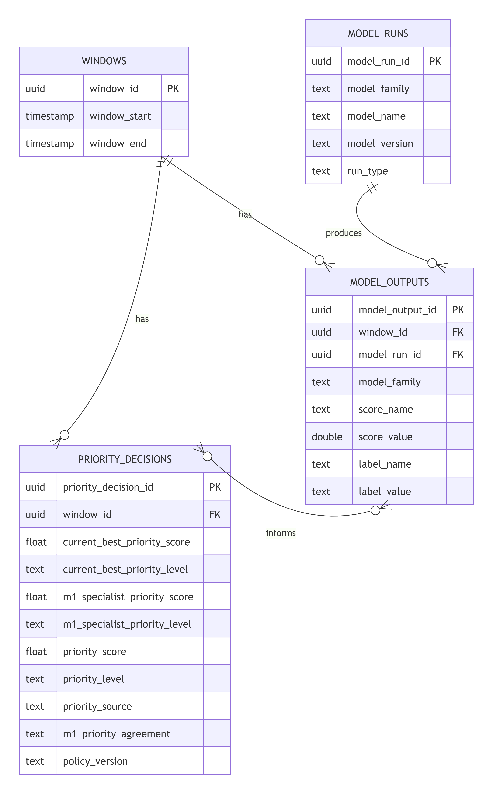
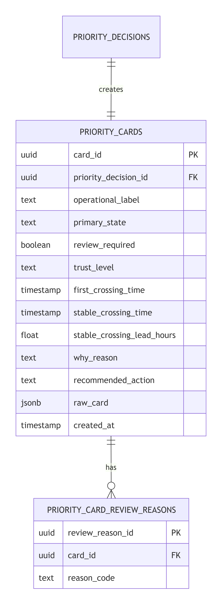
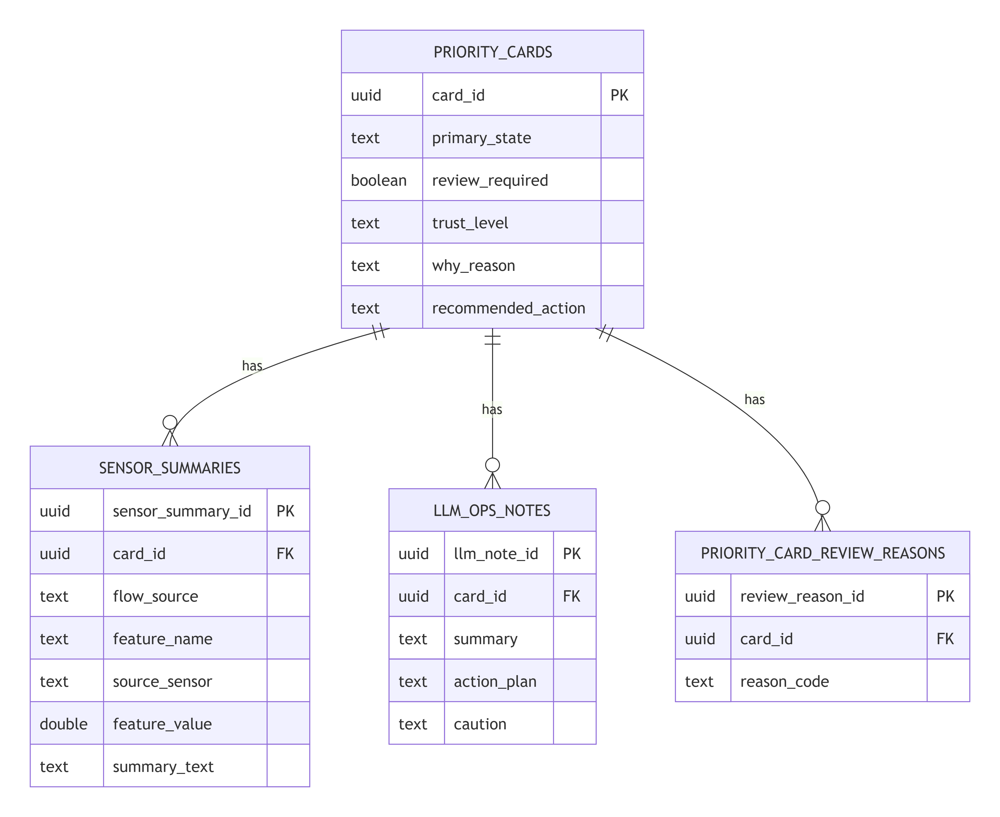

# 06_운영보조_데이터구조

## 요약
- 운영보조 에이전트의 데이터 흐름 문서를 한 묶음으로 정리했습니다.
- Raw, model, Priority, OPS 데이터와 보충 설명을 포함합니다.

---

## Raw Data

# 0. 구조도


# 1. 나누는 방법

## 1. 데이터의 종류별로
| 종류       | 예시                                                  | 역할                  |
| -------- | --------------------------------------------------- | ------------------- |
| 센서 시계열   | 온도, 유량, valve position, pump status                 | 모델 입력의 원재료          |
| 고장 메타데이터 | fault event, report date, fault label, efd_possible | window label과 검증 기준 |

그래서 DB도 sensor_readings과 fault_events로 나눠야 한다.

## 2. 모델 입력 단위 window

windows, window_features로 설계한다.

window_features는 센서 원본을 모델 입력용 숫자로 요약한 값이다.

#### window_features 예시

|window_id|feature_name|feature_value|
|---|---|---|
|win_001|p_hc1_return_temperature__last_1d_mean_minus_prev_6d_mean|-0.42|
|win_001|outdoor_temperature__last_minus_first|3.10|
|win_001|p_net_meter_flow__last_1d_std_minus_prev_6d_std|0.87|

---

## model Data

# 0. 구조도


# 1. MODEL_RUNS
|컬럼|의미|
|---|---|
|`model_run_id`|모델 실행 ID|
|`model_family`|모델 계열. 예: `anomaly`, `risk`, `leadtime`, `m1_specialist`, `priority`|
|`model_name`|실제 모델/정책 이름|
|`model_version`|모델 버전|
|`run_type`|실행 방식. 예: `batch`, `replay`, `imported_score`, `policy`|

# 2. MODEL_OUTPUTS
|컬럼|의미|
|---|---|
|`model_output_id`|모델 산출물 ID|
|`window_id`|어떤 window의 결과인지|
|`model_run_id`|어떤 모델 실행에서 나온 결과인지|
|`model_family`|모델 계열|
|`score_name`|점수 이름|
|`score_value`|점수 값|
|`label_name`|라벨 이름|
|`label_value`|라벨 값|
# 3. PRIORITY_DECISIONS
|컬럼|의미|
|---|---|
|`priority_decision_id`|우선순위 판단 ID|
|`window_id`|어떤 window에 대한 판단인지|
|`current_best_priority_score`|기존 Current-Best priority 점수|
|`current_best_priority_level`|기존 Current-Best priority level|
|`m1_specialist_priority_score`|M1 specialist priority 점수|
|`m1_specialist_priority_level`|M1 specialist priority level|
|`priority_score`|최종 hybrid priority 점수|
|`priority_level`|최종 level|
|`priority_source`|어떤 공식/정책으로 계산했는지|
|`m1_priority_agreement`|Current-Best와 M1이 같은 방향인지|

---

## Priority Data

# 0. 구조도


# 1.PRIORITY_CARDS
|컬럼|의미|
|---|---|
|`card_id`|priority card ID|
|`priority_decision_id`|어떤 priority decision에서 나온 카드인지|
|`operational_label`|운영 해석 라벨. 예: `predictive_fault_risk`|
|`primary_state`|최종 운영 상태. 예: `normal`, `fault`, `predictive_fault_risk`|
|`review_required`|운영자 검토 필요 여부|
|`trust_level`|신뢰도/주의 수준|
|`first_crossing_time`|기준을 처음 넘은 시점|
|`stable_crossing_time`|안정적으로 기준을 넘은 시점|
|`stable_crossing_lead_hours`|안정 crossing 기준 lead time|
|`why_reason`|왜 이런 판단이 나왔는지|
|`recommended_action`|권장 운영 액션|
|`raw_card`|원본 priority card 전체 JSON|
|`created_at`|생성 시각|
# 2. PRIORITY_CARD_REVIEW_REASONS
| 컬럼                 | 의미                   |
| ------------------ | -------------------- |
| `review_reason_id` | review reason row ID |
| `card_id`          | 어떤 card의 reason인지    |
| `reason_code`      | review 사유 코드         |
# 3. 저장 구조

window 관련 값      → windows
모델 신호 값        → model_outputs
우선순위 계산 값    → priority_decisions
운영 설명/액션 값   → priority_cards
review 사유         → priority_card_review_reasons
원본 전체 55개      → priority_cards.raw_card JSONB

---

## OPS Data

# 0. 구조도





# 1. SENSOR_SUMMARIES

| 컬럼                  | 타입       | 설명                                                                         |
| ------------------- | -------- | -------------------------------------------------------------------------- |
| `sensor_summary_id` | uuid, PK | 센서 요약 ID                                                                   |
| `card_id`           | uuid, FK | 연결된 priority card                                                          |
| `window_id`         | uuid, FK | 연결된 분석 window                                                              |
| `flow_source`       | text     | 어떤 흐름의 근거인지. `shared`, `flow1_anomaly_current_best`, `flow2_m1_specialist` |
| `feature_name`      | text     | 사용된 feature 이름                                                             |
| `source_sensor`     | text     | 원천 센서 이름                                                                   |
| `meaning`           | text     | feature 의미                                                                 |
| `feature_value`     | double   | 해당 window의 feature 값                                                       |
| `direction`         | text     | 증가/감소/변동성 증가 등 해석 방향                                                       |
| `display_rank`      | int      | 카드에 보여줄 순서                                                                 |
| `summary_text`      | text     | 운영자에게 보여줄 짧은 설명                                                            |
# 2. LLM_OPS_NOTES

| 컬럼             | 타입        | 설명                |
| -------------- | --------- | ----------------- |
| `llm_note_id`  | uuid, PK  | LLM note ID       |
| `card_id`      | uuid, FK  | 연결된 priority card |
| `summary`      | text      | 한두 문장 운영 요약       |
| `action_plan`  | text      | 권장 조치             |
| `caution`      | text      | 주의사항/신뢰도/리뷰 필요 사유 |
| `prompt_input` | jsonb     | LLM에 넣은 구조화 입력    |
| `llm_output`   | jsonb     | LLM 원본 출력         |
| `created_at`   | timestamp | 생성 시각             |

---

## feature_meta_map

## 1. 역할

```
feature_name을 보면
→ source_sensor랑 meaning을 붙여준다
```

## 2. 최소 매핑표

```PYTHON
FEATURE_META = {
    "missing_rate": {
        "source_sensor": "data_quality",
        "meaning": "window 내 결측률"
    },
    "missing_count": {
        "source_sensor": "data_quality",
        "meaning": "window 내 결측 개수"
    },
    "max_timestamp_gap_minutes": {
        "source_sensor": "data_quality",
        "meaning": "window 내 최대 시간 간격"
    },

    "p_return_gap__last_minus_first": {
        "source_sensor": "p_return_gap",
        "meaning": "window 내 return gap 변화"
    },
    "p_net_meter_flow__last_1d_std_minus_prev_6d_std": {
        "source_sensor": "p_net_meter_flow",
        "meaning": "최근 1일 유량 변동성과 이전 6일 유량 변동성 차이"
    },
    "s_hc1_supply_temperature__last_1d_mean_minus_prev_6d_mean": {
        "source_sensor": "s_hc1_supply_temperature",
        "meaning": "최근 1일 공급온도와 이전 6일 공급온도 평균 차이"
    }
}
```
