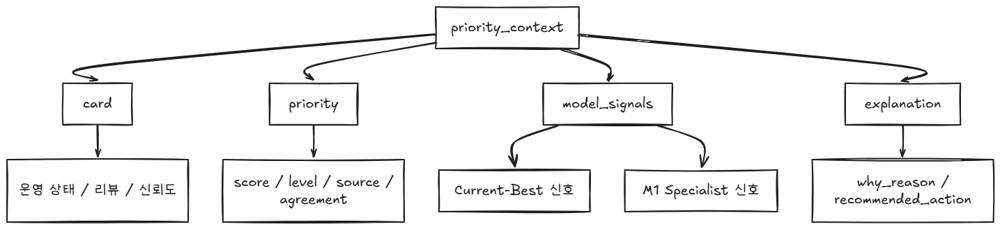

# 07_운영보조_스키마와예시

## 요약
- 운영보조 에이전트의 입력/출력 스키마와 예시 JSON을 함께 정리했습니다.
- 팀이 실제 입출력 형태를 빠르게 확인할 수 있습니다.

---

## ops_agent_input.schema.json


# 1. raw_context


### 예시 json: `raw_context.json`

- 매핑표는 만들어줘야 한다: `feature_meta_map`

---

## 2. priority_context



### 예시 json: `priority_context.json`

---

## 3. 최종 예시 json: `ops_agent_input.json`

#### 호출 단위: 

```
card_id 1개 = ops_agent_input.json 1개 = LLM 호출 1번
```

#### 흐름:

```
card_id 선택
→ DB에서 raw_context 조립
→ DB에서 priority_context 조립
→ 둘을 합쳐 ops_agent_input.json 생성
→ LLM 호출
→ 결과를 LLM_OPS_NOTES에 저장
```

---

## ops_agent_output.schema.json

## 예시 json: `ops_agent_output.json`


### 역할
|필드|역할|
|---|---|
|`summary`|이 카드가 무슨 상황인지 한눈에 설명|
|`action_plan`|운영자가 다음에 뭘 확인/조치해야 하는지|
|`caution`|오탐, 데이터 품질, 모델 신뢰도 같은 주의사항|

### DB 저장한다면, LLM_OPS_NOTES 랑 바로 연결

```
LLM_OPS_NOTES
- summary
- action_plan
- caution
- prompt_input
- llm_output
- created_at
```

### 흐름

```
ops_agent_input.json
→ LLM
→ summary / action_plan / caution
→ LLM_OPS_NOTES 저장
```

---

## ops_agent_input.json

{
  "raw_context": {
    "window": {
      "window_id": "uuid",
      "manufacturer_id": "manufacturer 1",
      "substation_id": 31,
      "configuration_type": "SH + DHW",
      "window_start": "2020-01-11T00:00:00",
      "window_end": "2020-01-11T06:00:00"
    },
    "features": [
      {
        "feature_name": "missing_rate",
        "source_sensor": "data_quality",
        "meaning": "window 내 결측률",
        "feature_value": 0.02
      }
    ]
  },
  "priority_context": {
    "card": {
      "card_id": "uuid",
      "operational_label": "urgent",
      "primary_state": "pre_fault",
      "review_required": true,
      "trust_level": "medium"
    },
    "priority": {
      "priority_decision_id": "uuid",
      "priority_score": 87.4,
      "priority_level": "urgent",
      "priority_source": "hybrid",
      "m1_priority_agreement": "agree"
    },
    "model_signals": {
      "current_best_priority_score": 82.1,
      "current_best_priority_level": "high",
      "m1_specialist_priority_score": 91.8,
      "m1_specialist_priority_level": "urgent"
    },
    "explanation": {
      "why_reason": "M1 specialist and current-best both indicate elevated priority.",
      "recommended_action": "Review the substation operation and inspect return temperature behavior."
    }
  }
}

---

## ops_agent_output.json

{
  "summary": "현재 카드의 우선순위가 높은 이유를 운영자가 이해할 수 있게 한 문단으로 요약합니다.",
  "action_plan": "운영자가 바로 확인하거나 조치할 일을 짧게 제안합니다.",
  "caution": "모델 판단을 그대로 믿기 전에 주의해야 할 점을 적습니다."
}

---

## priority_context.json

{
  "priority_context": {
    "card": {
      "card_id": "uuid",
      "operational_label": "urgent",
      "primary_state": "pre_fault",
      "review_required": true,
      "trust_level": "medium"
    },
    "priority": {
      "priority_decision_id": "uuid",
      "priority_score": 87.4,
      "priority_level": "urgent",
      "priority_source": "hybrid",
      "m1_priority_agreement": "agree"
    },
    "model_signals": {
      "current_best_priority_score": 82.1,
      "current_best_priority_level": "high",
      "m1_specialist_priority_score": 91.8,
      "m1_specialist_priority_level": "urgent"
    },
    "explanation": {
      "why_reason": "M1 specialist and current-best both indicate elevated priority.",
      "recommended_action": "Review the substation operation and inspect return temperature behavior."
    }
  }
}

---

## raw_context.json

{
  "raw_context": {
    "window": {
      "window_id": "uuid",
      "manufacturer_id": "manufacturer 1",
      "substation_id": 31,
      "configuration_type": "SH + DHW",
      "window_start": "2020-01-11T00:00:00",
      "window_end": "2020-01-11T06:00:00"
    },
    "features": [
      {
        "feature_name": "missing_rate",
        "source_sensor": "data_quality",
        "meaning": "window 내 결측률",
        "feature_value": 0.02
      },
      {
        "feature_name": "p_return_gap__last_minus_first",
        "source_sensor": "p_return_gap",
        "meaning": "window 내 return gap 변화",
        "feature_value": 4.2
      }
    ]
  }
}
